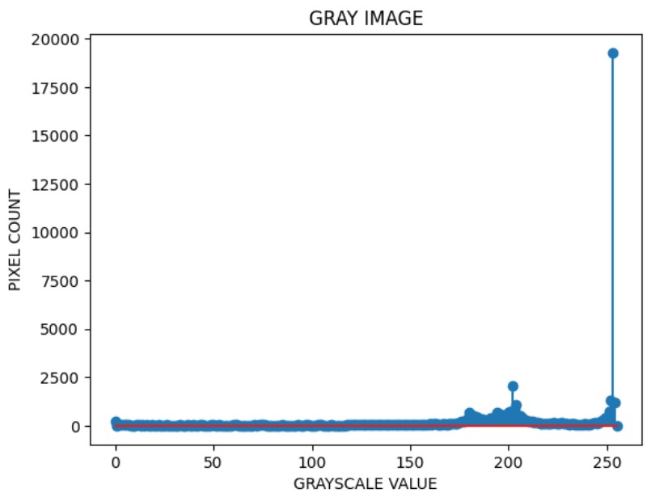
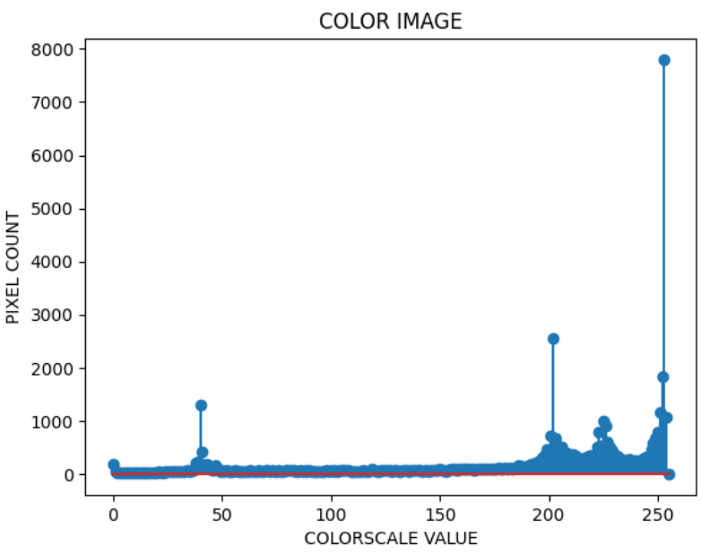

# Histogram and Histogram Equalization of an image
## Aim
To obtain a histogram for finding the frequency of pixels in an Image with pixel values ranging from 0 to 255. Also write the code using OpenCV to perform histogram equalization.

## Software Required:
Anaconda - Python 3.7

## Algorithm:
### Step1: 
Read the gray and color image using imread()

### Step2:
Print the image using imshow().

### Step3:
Use calcHist() function to mark the image in graph frequency for gray and color image.

### Step4: 
cv2.equalize() is used to transform the gray image to equalized form.

### Step5: 
The Histogram of gray scale image and color image is shown.

## Program:
```
# Developed By:Dharani Elango
# Register Number: 212221230021
```
```

# Write your code to find the histogram of gray scale image and color image channels.

import cv2
import matplotlib.pyplot as plt 
from google.colab.patches import cv2_imshow

#gray scale and color image  
gray_image = cv2.imread("gray.jpeg")
color_image = cv2.imread("color.jpeg")
cv2_imshow(gray_image)
cv2_imshow(color_image)
cv2.waitKey(0)


# Display the histogram of gray scale image and any one channel histogram from color image

gray_hist=cv2.calcHist([gray_image],[0],None,[256],[0,255])
color_hist=cv2.calcHist([color_image],[2],None,[256],[0,255])
plt.figure()
plt.title("GRAY IMAGE")
plt.xlabel("GRAYSCALE VALUE")
plt.ylabel("PIXEL COUNT")
plt.stem(gray_hist)
plt.show()
plt.figure()
plt.title("COLOR IMAGE")
plt.xlabel("COLORSCALE VALUE")
plt.ylabel("PIXEL COUNT")
plt.stem(color_hist)
plt.show()


# Write the code to perform histogram equalization of the image. 

import cv2
import numpy as np
import matplotlib.pyplot as plt
Gray_image=cv2.imread('gray.jpeg')
equalize=cv2.cvtColor(Gray_image,cv2.COLOR_BGR2HSV)
cv2_imshow(Gray_image)
cv2_imshow(equalize)
cv2.waitKey(0)
cv2.destroyAllWindows()
```
## Output:
### Input Grayscale Image and Color Image


### Histogram of Grayscale Image and any channel of Color Image



### Histogram Equalization of Grayscale Image


## Result: 
Thus the histogram for finding the frequency of pixels in an image with pixel values ranging from 0 to 255 is obtained. Also,histogram equalization is done for the gray scale image using OpenCV.
